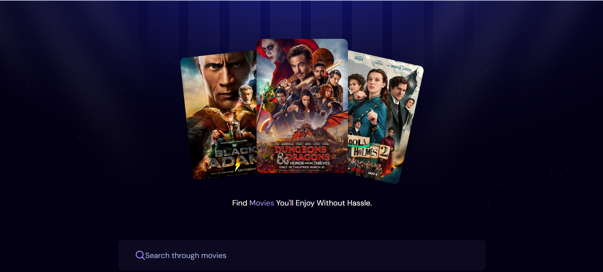
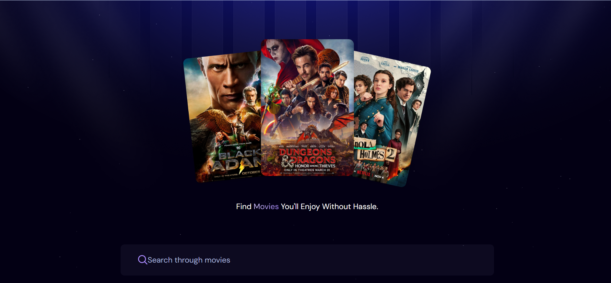
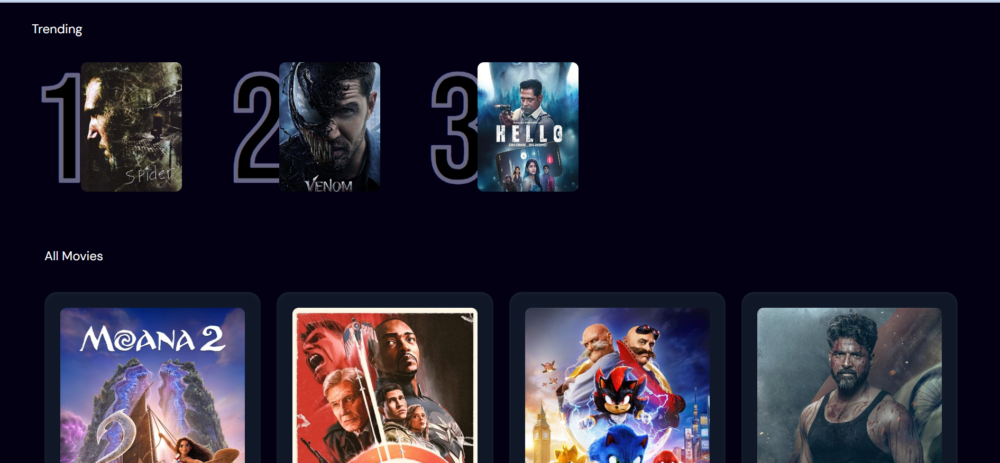
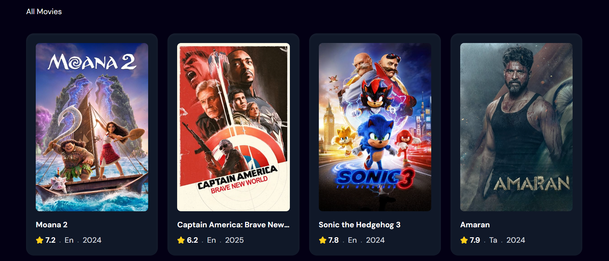

# Movie Search App

## Overview
The **Movie Search App** is a React + Vite application that allows users to discover the latest movies, search for specific titles, and view the top 5 most searched movies. The app utilizes an API to fetch real-time movie data and provides a seamless user experience with Tailwind CSS for styling.

## Features
- Fetches and displays the latest movies from an API.
- Search functionality to find specific movies.
- Tracks and displays the top 5 most searched movies.
- Responsive and visually appealing UI with Tailwind CSS.

## Tech Stack
- **Frontend:** React, Vite, Tailwind CSS
- **Backend:** Movie API (replace with actual API name)
- **State Management:** React Hooks (useState, useEffect)

## Installation & Setup
1. **Clone the repository:**
   ```sh
   git clone https://github.com/your-username/movie-search-app.git
   cd movie-search-app
   ```
2. **Install dependencies:**
   ```sh
   npm install
   ```
3. **Start the development server:**
   ```sh
   npm run dev
   ```
4. **Open the app:**
   Visit `http://localhost:5173/` in your browser.

## Usage
- The homepage displays the latest movies fetched from the API.
- Use the search bar to look for specific movies.
- The top 5 most searched movies are displayed prominently.

## Screenshots





## Contribution
Feel free to fork this repository and submit pull requests for improvements.

## Contact
For any queries or collaboration opportunities, reach out to **Farhan Shafaqat**:  
📧 Email: farhanshafaqatbasra@gmail.com  
📍 Location: Sharjah, UAE
